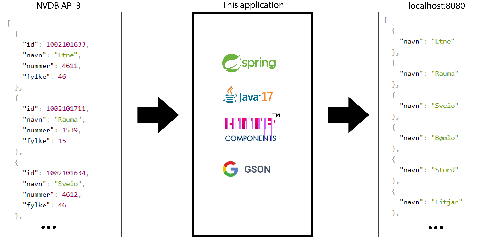

# Statens vegvesen - parse a list of Norwegian cities
This project gets details of Norwegian cities in array from Statens vegvesen's API and convert them to simple array of vities. Here we can learn how we can fetch data from an API and parse it to Java object. This project was originally created for the students of Software Architecture and Frameworks (DAVE3615) in 2017.

##

